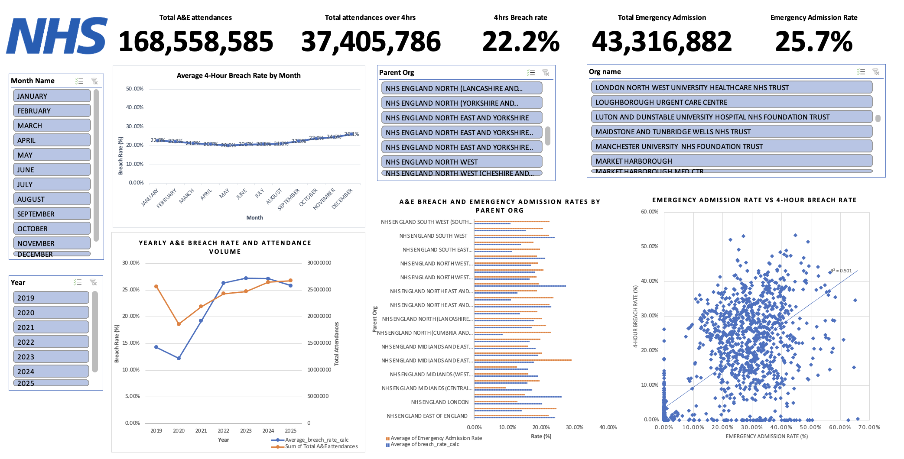
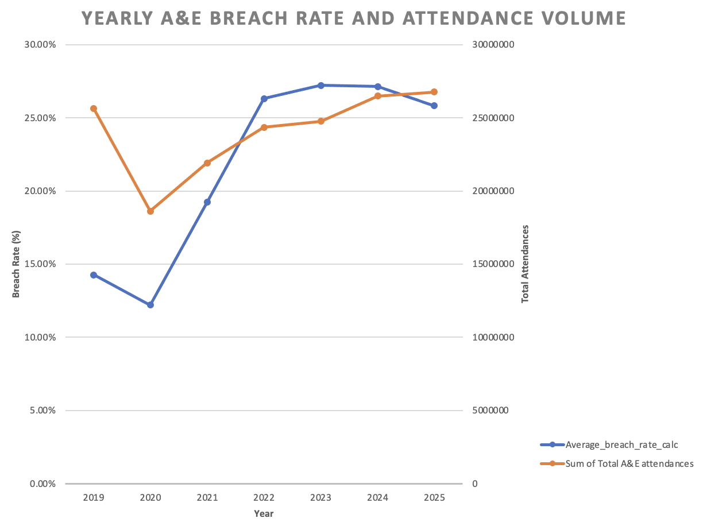
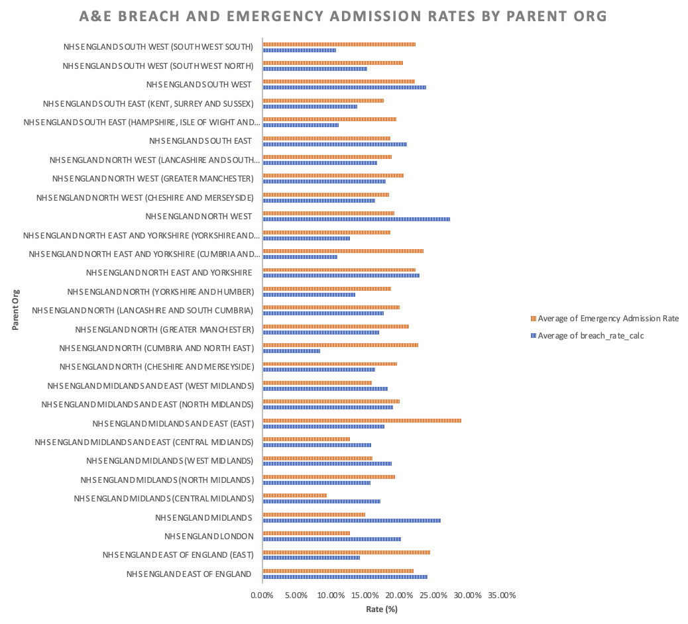
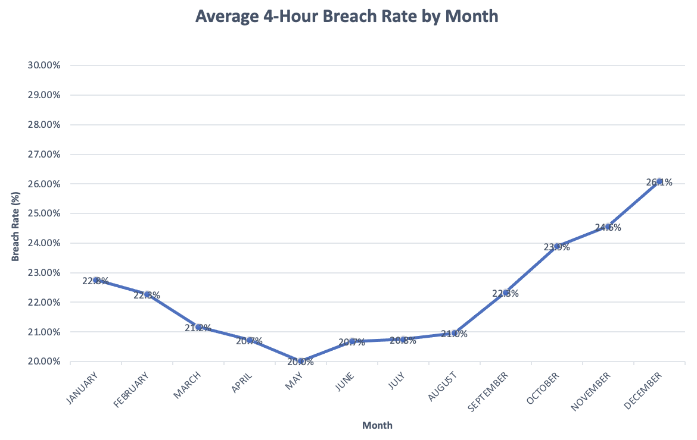

# NHS England A&E Performance Dashboard

## Project Overview
An interactive Excel dashboard analysing NHS England Accident and 
Emergency performance across 168.6 million attendances from 2019 
to 2025, focusing on the 4-hour breach rate across all NHS England 
regions and organisations.

## Tools Used
- Microsoft Excel — PivotTables, Slicers, Charts, Conditional Formatting

## Key Findings
- 90% surge in the national breach rate from 14.3% in 2019 to 27.1% in 2024
- December recorded the peak breach rate at 26.1% vs a May low of 20.0%
- 19 percentage point gap between best region (8.5%) and worst (27.4%)
- 37.4 million patients waited longer than 4 hours across the period
- Average breach rate of 22.2% across all organisations and years

## Dashboard Features
- Dynamic slicers to filter by region, year, and organisation
- Yearly trend chart showing breach rate and attendance volumes
- Monthly seasonal trend chart
- Regional benchmarking charts
- KPI cards showing headline figures

## Dashboard Preview

## Files in This Repository
| File | Description |
|------|-------------|
| NHS_Dashboard(NHS ENGLAND AE.xlsx) | Interactive Excel dashboard |
| [NHS Data source](https://www.england.nhs.uk/statistics/statistical-work-areas/ae-waiting-times-and-activity/) | Raw source data |

## Data Source
NHS England Monthly A&E Returns (official published statistics)
Reporting period: January 2019 — December 2025

## Live Interactive Dashboard
Click here to view and interact with the dashboard in your browser:
[Open Dashboard](https://1drv.ms/x/c/560da05e71bcac37/IQAStxvCJ0aAQZAboepK5YsiAa8IbxBtw-_6EHg017AP6wI?e=lxvsLr)
